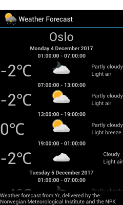

Weather Forecast
================

This application downloads and displays weather forecasts from the yr.no
service.



Adding, removing and selecting locations
----------------------------------------

The application is not configured to use any default locations, but a list of
preset locations are supplied. Select the text field at the bottom of the
screen, start entering a place name, and suggestions for the location will be
presented. You can optionally select one of the suggestions. Press the Add
button to add the location to the list.

To remove a location from the list, press and hold the relevant item in the
list until the Remove and Cancel buttons appear below the list. Press Remove to
remove the item or Cancel to keep it.

To view a forecast for a location, tap the relevant item. If a connection to
the yr.no server can be established, the location list will be hidden and the
forecast will be shown. Otherwise, a "No connection" message will be displayed.

Building the application
------------------------

The application is written in the Serpentine language which requires the
[DUCK](http://www.boddie.org.uk/david/Projects/Python/DUCK/README.html)
software to be installed or on the `PYTHONPATH`. Additionally, you will need
to have created a key and signing certificate in order to create an installable
package unless you are using a separate signing process.

The current version of this application (1.0.4) has been tested to build with
DUCK version 1.0.3.

The `build.py` script supplied with the application can then be run in the
following way, where `<key.pem>` and `<cert.pem>` are the locations of your
key and certificate files:

```\
./build.py <key.pem> <cert.pem> WeatherForecast.apk
```

You can then install the package on your Android device in the usual way.

Alternatively, if you are using a separate signing process, you can build the
package without signing it in the following way:

```\
./build.py WeatherForecast.apk
```

About the yr.no service and data
--------------------------------

The weather forecasts are obtained from the service at yr.no and the
application tries to follow the terms, conditions and guidelines for use of
that service:

http://om.yr.no/verdata/vilkar/

More information about the data obtained from the service can be found at the
following locations:

http://om.yr.no/verdata/free-weather-data/
http://om.yr.no/verdata/xml/
http://om.yr.no/verdata/xml/spesifikasjon/

The place names included with the application were obtained from the following
locations:

http://fil.nrk.no/yr/viktigestader/noreg.txt
http://fil.nrk.no/yr/viktigestader/verda.txt

This information is presumably provided under the terms of the Creative Commons
Attribution 4.0 International (CC BY 4.0) license, as used by the geonames.org
service for the data the noreg.txt and verda.txt files are based on.

The symbols supplied were obtained from the following repository and are
licensed under the MIT license:

https://github.com/YR/weather-symbols/
https://github.com/YR/weather-symbols/blob/master/LICENSE

License
-------

The source code is licensed under the GNU General Public License version 3 or
later. See the COPYING file for more information about this license. A short
version of the license is given below:

Copyright (C) 2017 David Boddie <david@boddie.org.uk>

This program is free software: you can redistribute it and/or modify
it under the terms of the GNU General Public License as published by
the Free Software Foundation, either version 3 of the License, or
(at your option) any later version.

This program is distributed in the hope that it will be useful,
but WITHOUT ANY WARRANTY; without even the implied warranty of
MERCHANTABILITY or FITNESS FOR A PARTICULAR PURPOSE.  See the
GNU General Public License for more details.

You should have received a copy of the GNU General Public License
along with this program.  If not, see <http://www.gnu.org/licenses/>.
